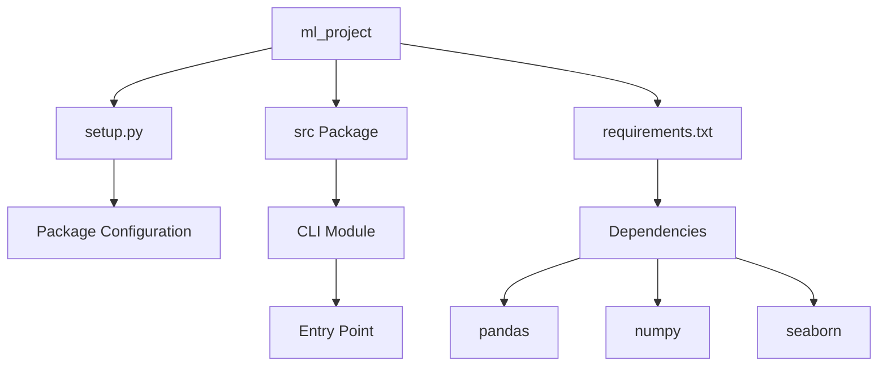

# ml_end_to_end

# Project Repository

A newly initialized project repository.

## Tech Stack

To be determined based on project development.

### Prerequisites

- Python 3.7+
- pip

## Installation and Setup

1. Clone the repository:
   ```bash
   git clone <repository-url>
   cd <project-directory>
   ```

2. Install dependencies (once project structure is established):
   ```bash
   # Installation instructions will be added as the project develops
   ```

3. Configure environment (as needed):
   - Create necessary configuration files
   - Set up environment variables

## Usage

Run the project via the command-line interface:

```bash
ml_project
```

## Architecture Overview

This project is in its initial phase of development. The directory structure and architecture will be established as the project progresses.

## Contributing

Contributions are welcome. Please follow the project's coding standards and submit pull requests for review.

## License

See LICENSE file for details.

# ML Project

A comprehensive end-to-end machine learning project demonstrating best practices for data processing, model training, and deployment.

## Features

- Data processing and validation with pandas
- Numerical computations with numpy
- Statistical visualization with seaborn
- Modular package structure
- CLI entry point for easy execution

## Installation

### Setup

1. Clone the repository:
   ```bash
   git clone <repository-url>
   cd ml_project
   ```

2. Install dependencies:
   ```bash
   pip install -r requirements.txt
   ```

3. Install the package in development mode:
   ```bash
   pip install -e .
   ```

## Project Structure

```
ml_project/
├── src/                    # Source code directory
├── requirements.txt        # Project dependencies
├── setup.py               # Package configuration and metadata
└── README.md              # This file
```

## Dependencies

- **pandas**: Data manipulation and analysis
- **numpy**: Numerical computing and array operations
- **seaborn**: Statistical data visualization

## Project Metadata

- **Version**: 1.0.1
- **Author**: sidhant
- **Contact**: sidhanta1989.maharana@gmail.com

## System Architecture


